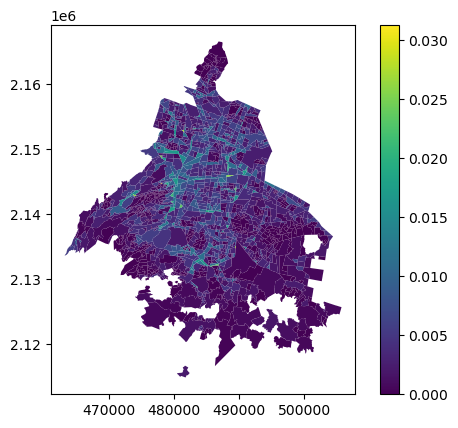

pyLandUseMX
================

<!-- WARNING: THIS FILE WAS AUTOGENERATED! DO NOT EDIT! -->

<div>


</div>

El uso de suelo es un insumo básico para diferentes investigaciones en
el contexto urbano: criminología, movilidad y diseño urbano, por
ejemplo, son campos en los que contar con información sobre el uso real
del suelo resulta fundamental para realizar investigaciones
cuantitativas. Esta librería busca ofrecer diferentes opciones para
construir variables e índices para caracterizar el uso de suelo *real*,
es decir el uso observado, en el contexto de las ciudades mexicanas.

Además de mediciones sobre uso de suelo, la librería provee métodos para
extraer variables de estructura urbana como mezcla e intensidad de uso
de suelo. También implementa algunas herramientas básicas de análisis
para extraer patrones y relaciones en diferentes escalas.

La librería aprovecha diferentes fuentes de datos públicas como el DENUE
y el Censo para estimar variables de uso de suelo y su cambio en el
tiempo. Provee métodos para definir tipos de uso de suelo y agregarlo en
diferentes unidades espaciales: mallas regulares, hexágonos y polígonos
arbitrarios (como colonias o AGEBS).

## Instalación

Por lo pronto, la manera más fácil de instalar la librería es usando
`pip` para instalar desde el repositorio. Antes es necesario asegurarse
de que las dependencias del sistema están instaladas:

- `gdal`
- `rtree`
- `libgeos`
- `proj`

En sistemas basados en `apt`:

``` sh
sudo apt-get install -y gdal-bin python3-gdal python3-rtree libspatialindex-dev libgeos-dev libproj-dev
```

Ya con las dependencias instaladas:

``` sh
pip install git+https://github.com/CentroGeo/pyLandUseMX
```

## Estructura

La librería está organizada en torno a dos conceptos básicos:
`Cobertura` y
[`UsoDeSuelo`](https://CentroGeo.github.io/pyLandUseMX/api/usodesuelo.html#usodesuelo).
Las `Coberturas` son formas de *cubrir* un área de estudio (una zona
metropolitana, por ejemplo) utilizando mallas regulares (cuadrados o
hexágonos) o polígonos de forma arbitraria (colonias o AGEBS, por
ejemplo). Estas coberturas definen la forma en la que vamos a agregar
variables para estudiar el uso de suelo y proveen los métodos para estas
agregaciones. El
[`UsoDeSuelo`](https://CentroGeo.github.io/pyLandUseMX/api/usodesuelo.html#usodesuelo)
integra una `cobertura` y una definición de las variables en torno a
categorías definidas por el usuario, a partir de esta integración, la
clase
[`UsoDeSuelo`](https://CentroGeo.github.io/pyLandUseMX/api/usodesuelo.html#usodesuelo)
provee diferentes herramientas para construir diferentes índices y
variables a partir de los datos integrados en las coberturas. El módulo
análisis provee métodos para analizar el uso de suelo.

Además de estos elemementos, la librería también contiene un módulo de
`descargas` que permite descargar datos ya procesados que sirven como
ejemplo para realizar diferentes tipos de análisis.

## Módulos

### Descargas

El módulo de `descargas`, provee funciones para descargar de nuestros
repositorios algunas capas que contienen variables relevantes para la
extracción y análisis de uso de suelo en México.

Las funciónes admiten un *path* en donde descargar los datos. La
documentación completa la encuentras en
[API/descargas](api/00_descargas.ipynb)

#### Red de transporte

Tenemos disponible para descargar un recorte de la red de transporte
obtenida de [OpenStreetMap](https://www.openstreetmap.org/) para la
región central del país (la Zona Metropolitana del Valle de México).


#### Polígonos del Sistema Urbano Nacional

También tenemos disponibles para descarga los polígonos de las ciudades
del [Sistema Urbano
Nacional](https://www.gob.mx/conapo/acciones-y-programas/sistema-urbano-nacional-y-zonas-metropolitanas)
(SUN) del 2018. Estos representan los límites de las principales
aglomeraciones urbanas del país.

##### Colonias CDMX

Tenemos una base de colonias para la CDMX basadas en la que se publica
en [Datos Abiertos CDMX](https://datos.cdmx.gob.mx/) con algunas
correcciones topológicas.

#### DENUE

Tenemos una base del DENUE integrada para el año 2022 en la Ciudad de
México.

### Uso de Suelo

El módulo `usodesuelo` provee métodos para extraer variables de Uso de
Suelo y medio construido en diferentes soportes espaciales. Además nos
permite calcular algunos índices básicos como mezclas e intensidad.

#### Soporte

Regularmente para trabajos sobre análisis de uso de suelo y cobertura
urbana se parte de la integración de la información en algún soporte
espacial. La clase
[`Soporte`](https://CentroGeo.github.io/pyLandUseMX/api/usodesuelo.html#soporte)
provee métodos para estructurar las fuentes de datos en dos grandes
tipos de soporte:

- Mallas regulares
- Polígonos arbitrarios

<div>

<table>
<colgroup>
<col style="width: 50%" />
<col style="width: 50%" />
</colgroup>
<tbody>
<tr class="odd">
<td style="text-align: center;"><div width="50.0%"
data-layout-align="center">
<figure>

<figcaption aria-hidden="true">Malla regular</figcaption>
</figure>
</div></td>
<td style="text-align: center;"><div width="50.0%"
data-layout-align="center">
<figure>

<figcaption aria-hidden="true">Colonias</figcaption>
</figure>
</div></td>
</tr>
</tbody>
</table>

</div>

Los soportes nos permiten agregar diferentes tipos de variables en
mallas regulares (por ejemplo, a la izquierda la red de calles agregada
en un raster) o en polígonos arbitrarios (a la derecha muestra de
comercios agregados en colonias)

<div>

<table>
<colgroup>
<col style="width: 50%" />
<col style="width: 50%" />
</colgroup>
<tbody>
<tr class="odd">
<td style="text-align: center;"><div width="50.0%"
data-layout-align="center">
<figure>

<figcaption aria-hidden="true">Red agregada en raster</figcaption>
</figure>
</div></td>
<td style="text-align: center;"><div width="50.0%"
data-layout-align="center">
<figure>

<figcaption aria-hidden="true">Comercios agregados en
colonias</figcaption>
</figure>
</div></td>
</tr>
</tbody>
</table>

</div>

#### UsoDeSuelo

La clase
[`UsoDeSuelo`](https://CentroGeo.github.io/pyLandUseMX/api/usodesuelo.html#usodesuelo)
parte de un soporte espacial y nos permite calcular algunos indicadores
sobre el uso de suelo y el medio construido.

### DENUE

Este módulo provee funcionalidades para trabajar con datos del
Directorio Nacional de Unidades Económicas y obtener algunas variables
de uso de suelo. La clase
[`Denue`](https://CentroGeo.github.io/pyLandUseMX/api/denue.html#denue)
permite seleccionar actividades económicas por clave SCIAN o agregar
estas actividades en categorías usando expresiones regulares.

<div>

> **Note**
>
> En el módulo `descargas` se puede obtener una base para la Ciudad de
> México con el Denue 2022. La estructura de esa base sirve como ejemplo
> para utilizar otras bases del Denue con la librería

</div>
